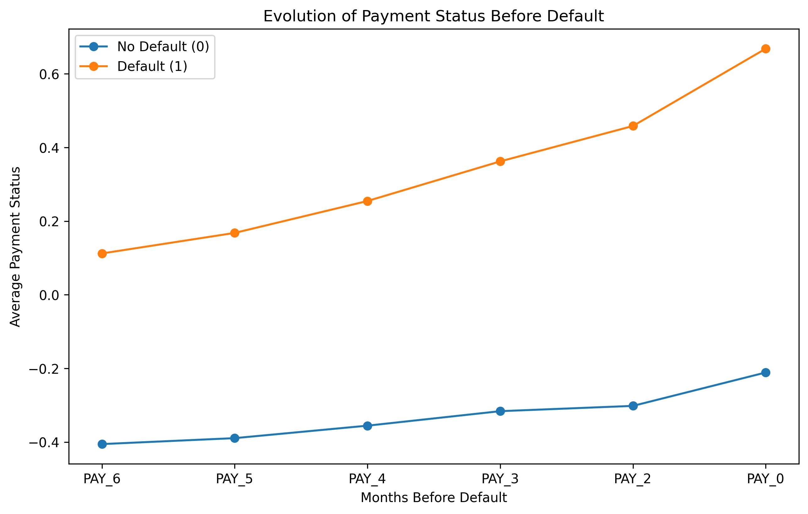
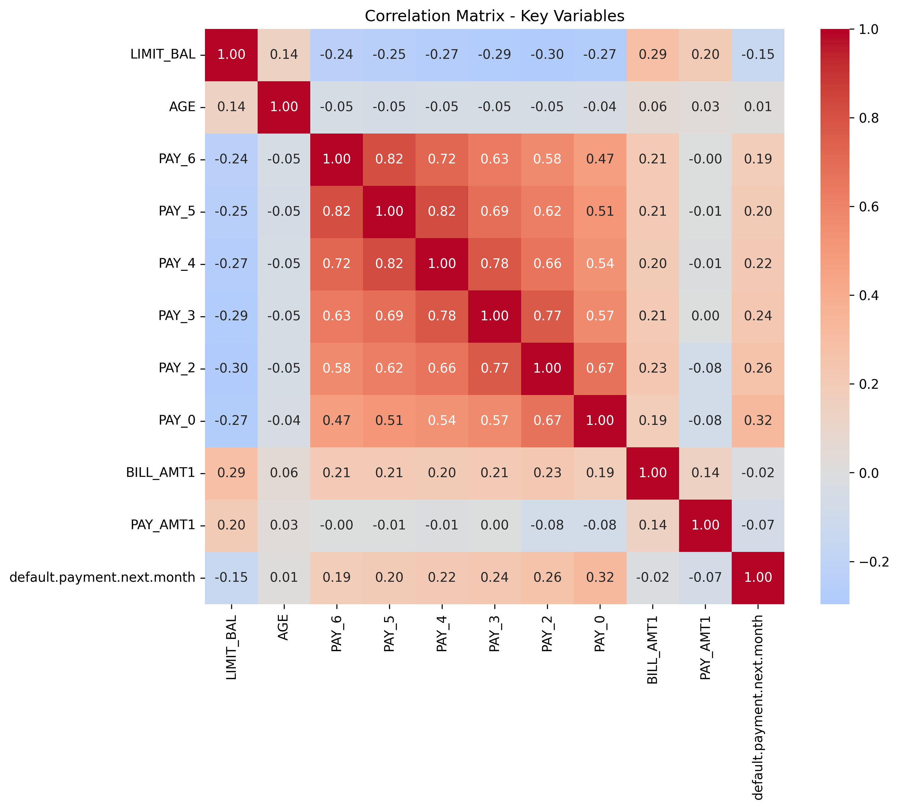

# Credit Risk Analysis - Default Prediction

## 📄 Dataset
### [Link](https://www.kaggle.com/datasets/uciml/default-of-credit-card-clients-dataset)

---
###  Main Columns
|          Columns         |                                       Description                                        |
|--------------------------|------------------------------------------------------------------------------------------|
|ID|ID of each client|
|LIMIT_BAL|Amount of given credit in NT dollars (includes individual and family/supplementary credit)|
|SEX|Gender (1=male, 2=female)|
|EDUCATION|(1=graduate school, 2=university, 3=high school, 4=others, 5=unknown, 6=unknown)|
|MARRIAGE|Marital status (1=married, 2=single, 3=others)|
|AGE|Age in years|
|PAY_0 -> PAY_6|payment status for the last 6 months (-1=pay duly, 1=payment delay for one month, 2=payment delay for two months, 8=payment delay for eight months, 9=payment delay for nine months and above)|
|BILL_AMT1 -> BILL_AMT6|Amount billed per month (NT dollars)|
|PAY_AMT1 -> PAY_AMT6|paid per month (NT dollars)|
|default.payment.next.month|Target variable: 1 = default, 0 = no default|

---
## 🔎 Exploratory Data Analysis (EDA)
### 1️⃣ Target Distribution
- Total rows: 30,000
- Total columns: 25
- Null data: none
- Default distribution: **78% non-default / 22% default**

---

### 2️⃣ Age & Credit Limit
- Average credit limit:
    - No default: 178,099
    - Default: 130,110
- Average age: ~35 years for both groups
**Insight:** Age does not significantly influence the credit limit; however, there is some difference.

---
### 3️⃣ Payment History (PAY_0 → PAY_6)
- Customers with defaults show a **progressive worsening** in recent payments.
- The correlation increases progressively from PAY_6 to PAY_0, confirming that **recent behavior is more important than distant historical behavior**.
**Suggested graph:** Evolution of PAY_6 → PAY_0 by group

---
### 4️⃣ Billing & Payment Amounts
- Similar average invoice amounts across groups.
- Customers who defaulted have significantly lower payments in all months.
- Example (median PAY/BILL ratio):

|          Ratio          | No default | Default |
--------------------------|------------|---------|
Median PAY/BILL (month 1) |    0.056   |  0.046  |

**Insight:** The ability or willingness to pay is key, more so than the total debt.

---
### 5️⃣ Payment Ratios
- We calculate `PAY_RATIO = PAY_AMT / BILL_AMT`
- PAY_0 is the most predictive variable with a correlation of **0.32**.
- Customers with defaults consistently have lower ratios, indicating a reduced capacity to cover accumulated debt.
- This insight is confirmed by the correlation matrix:

---
### 6️⃣ Key Predictive Features
- PAY_0 → most recent behavior
- PAY_0 → PAY_6 → deteriorating trend
- Payment ratios → relative payment capacity
- LIMIT_BAL → slight difference
- AGE → little effect

**Conclusion:**
Recent payment behavior and the proportion of payments relative to the invoice are the most decisive factors for predicting default.

